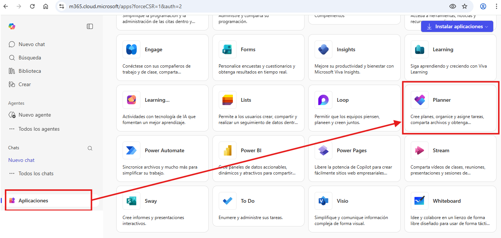
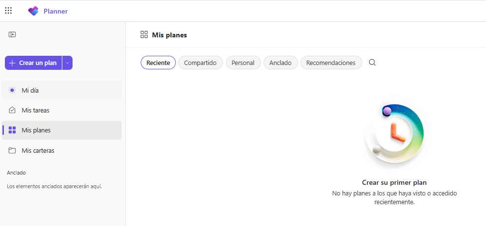
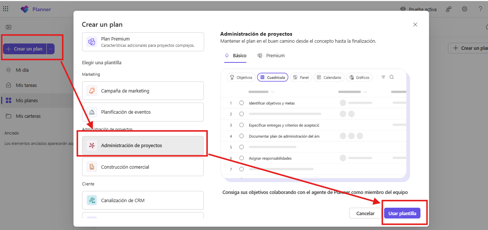
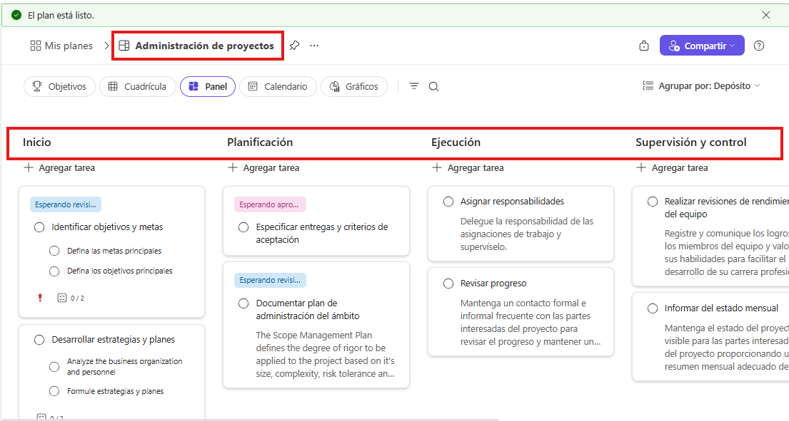
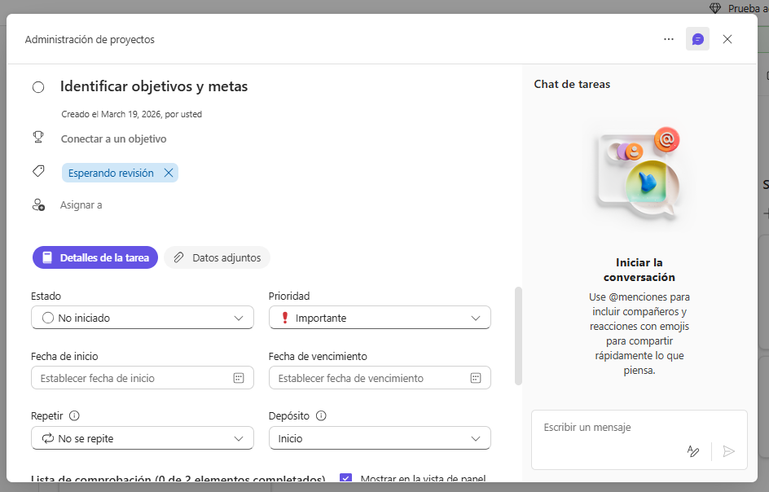
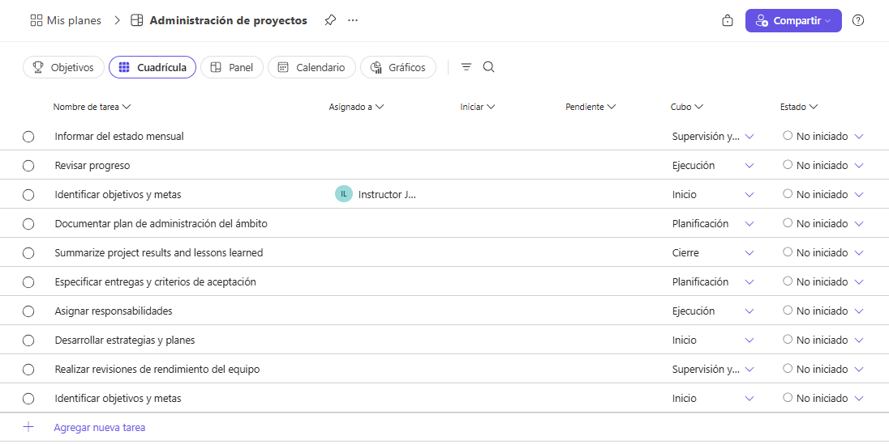
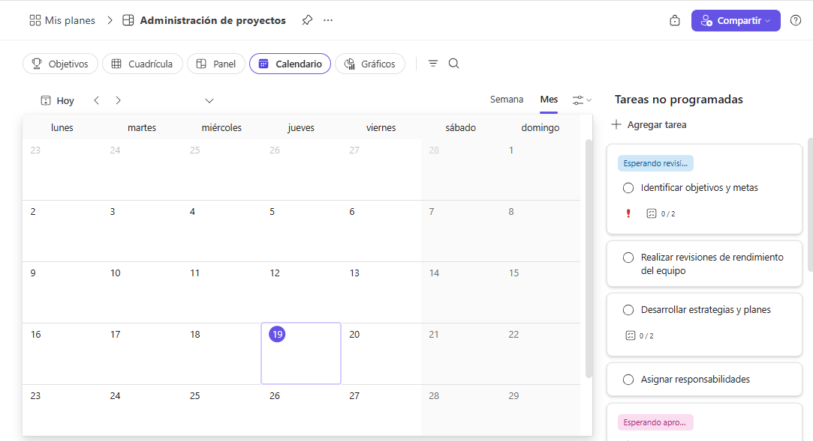
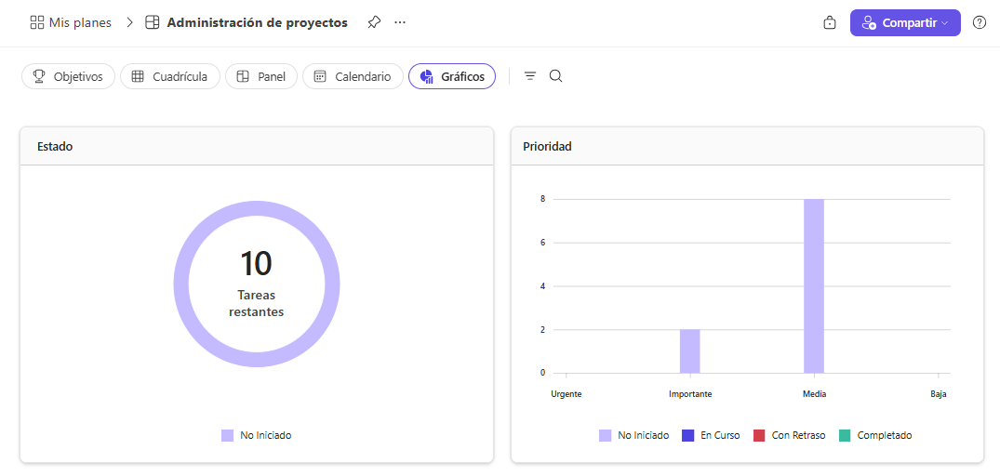
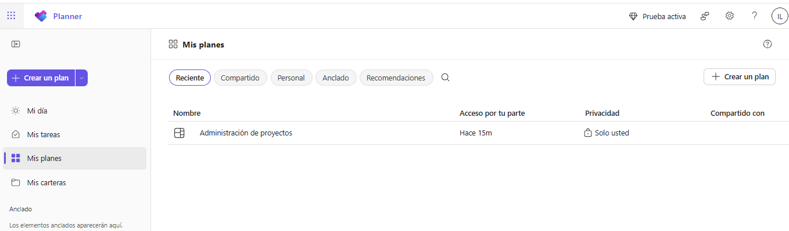

# 1.4 Laboratorio: Exploración guiada de la interfaz

## Objetivo de la práctica:
Al finalizar la práctica, serás capaz de:
- Reconocer la lógica básica de navegación de Microsoft Planner dentro de Microsoft 365.
- Identificar planes, buckets, tareas y vistas principales con sentido operativo.

## Duración aproximada:
- 15 minutos.

## Instrucciones

### Tarea 1. Reconocer la ruta de entrada y el espacio general de trabajo. (10 minutos)
- **Paso 1.** Ingresar al portal de Microsoft 365 con la cuenta de laboratorio:
    >https://m365.cloud.microsoft.com/

- **Paso 2.** Abrir Microsoft Planner desde el lanzador de aplicaciones o desde la experiencia disponible en el tenant.

    

- **Paso 3.** Identificar las áreas visibles para localizar planes recientes, trabajo compartido o tareas propias.

    

- **Paso 4.** Crear plan básico con una plantilla de referencia. (Administración de Proyectos)

    

---
### Tarea 2. Identificar la anatomía de un plan y de una tarea. 
- **Paso 1.** Ubicar el nombre del plan 

- **Paso 2.** Identificar dos o más buckets visibles y describir con qué criterio parecen estar organizados.

    

- **Paso 3.** Abrir una tarea del plan y reconocer sus elementos principales: título, responsable, fechas, progreso, etiquetas, comentarios y checklist si está disponible.

    

- **Paso 4.** Comparar dos tareas y decidir cuál está mejor redactada para ejecución real.

---
### Tarea 3. Explorar vistas de Microsoft Planner

- **Paso 1.** Abrir la vista **Cuadrícula** y reconocer de forma general cómo se muestran las tareas en formato de lista.

    
- **Paso 2.** Cambiar a la vista **Calendario** e identificar rápidamente cómo se organizan las tareas según sus fechas.

    

- **Paso 3.** Cambiar a la vista **Gráficos** y observar de manera general cómo se presenta el avance del plan mediante indicadores visuales.

    

- **Paso 4.** Analizar cuál de las tres vistas permite entender más rápido el estado general del trabajo.

---
## Resultado esperado
El participante finaliza el laboratorio con una lectura funcional de la interfaz de Planner y con capacidad para explicar como ingresar a Planner, cómo se organizan los planes y tareas, y cómo se pueden visualizar diferentes aspectos del trabajo mediante las vistas disponibles.

