# Laboratorio 2: Configurar un plan con miembros y permisos

## Objetivo de la práctica:
Al finalizar la práctica, serás capaz de:
- Crear un plan con propósito operativo claro.
- Incorporar miembros con criterio funcional dentro del entorno Microsoft 365.
- Aplicar reglas mínimas de acceso, orden y uso seguro del plan.

## Duración aproximada:
- 15 minutos.

## Instrucciones

### Tarea 1. Diseñar el propósito y crear el plan.
- **Paso 1.** Definir en una frase el propósito exacto del plan que se va a construir.
    - Ejemplo: "Plan de soporte técnico para incidentes de infraestructura TI en la región".
    - Ejemplo: "Plan de gestión de proyectos para la implementación de Microsoft 365 en la empresa".
    - Ejemplo: "Plan de seguimiento de tareas para el equipo de desarrollo de software en el proyecto".

- **Paso 2.** Crear un nuevo plan básico en Planner con un nombre corto, entendible y orientado al proceso operativo.
    - Ejemplo: "Soporte TI - Incidentes Infraestructura".

        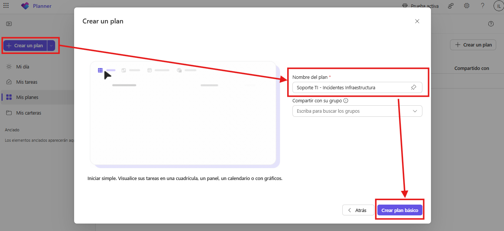

- **Paso 3.** Crear un grupo de Microsoft 365:
    - Dar clic en "Compartir" y luego en "Crear grupo".
    
        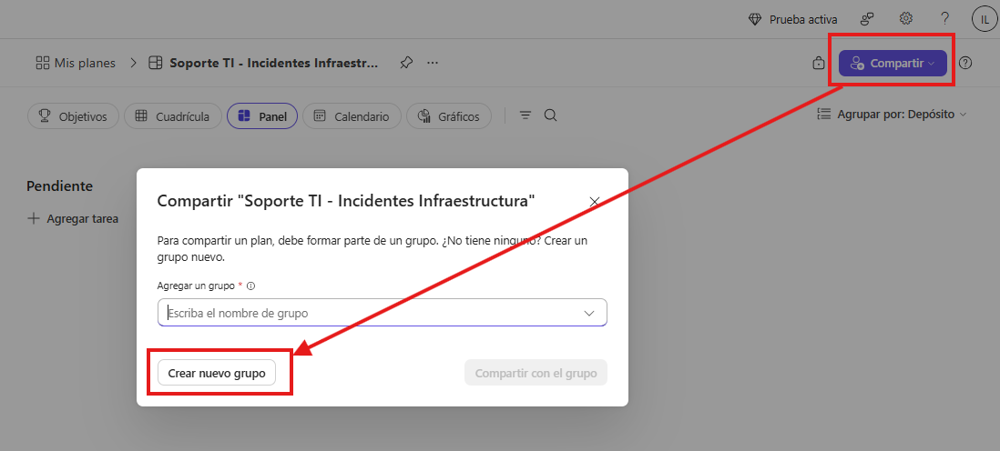
    
    - Nombre del grupo: "Soporte TI"
    - Descripción: "Grupo de soporte técnico para gestionar incidentes de infraestructura TI en la región".
    - Nivel de privacidad: Privado

        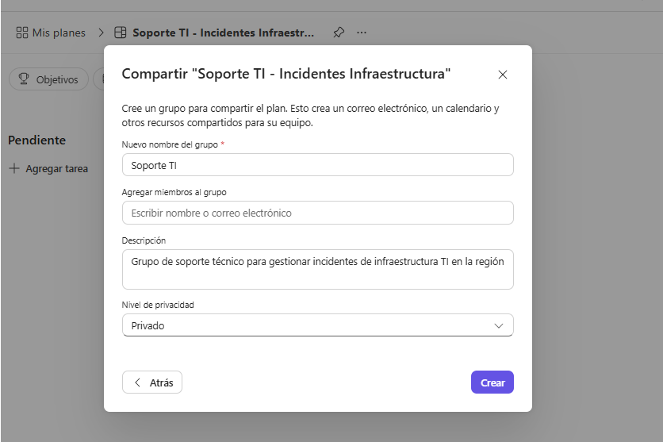

- **Paso 4.** Verificar que el nombre y el propósito no mezclen iniciativas no relacionadas.
---
### Tarea 2. Incorporar miembros y distinguir roles de participación.
- **Paso 1.** Agregar a los miembros definidos para el escenario de práctica, desde los grupos de outlook.
    - Dar clic en "compartir" y al lado derecho del nombre del grupo, dar clic en el icono enlace externo para abrir la configuración del grupo en outlook.

        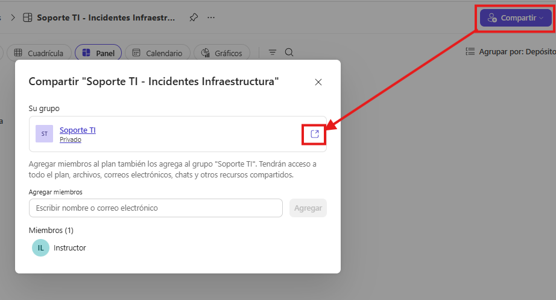

- **Paso 2.** En la ventana de configuración del grupo, dar clic en el nombre del grupo y luego en "Agregar miembros" para incluir a los usuarios pertinentes.

    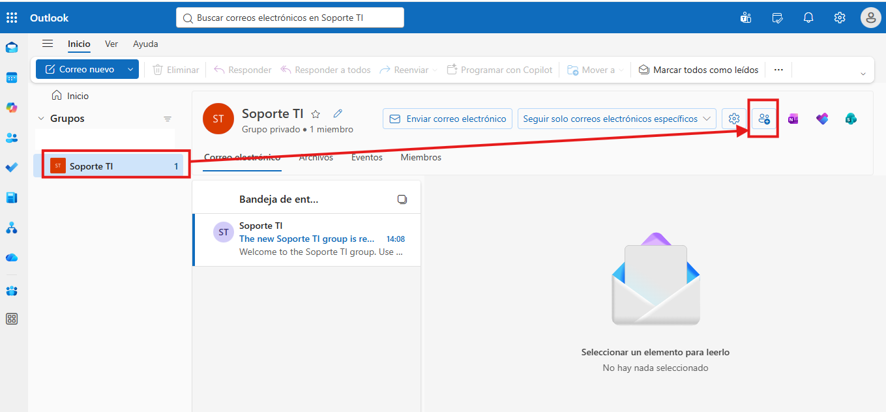

- **Paso 3.** Agregar usuarios al grupo y asignar un rol funcional a cada participante: Propietario o Miembro.

     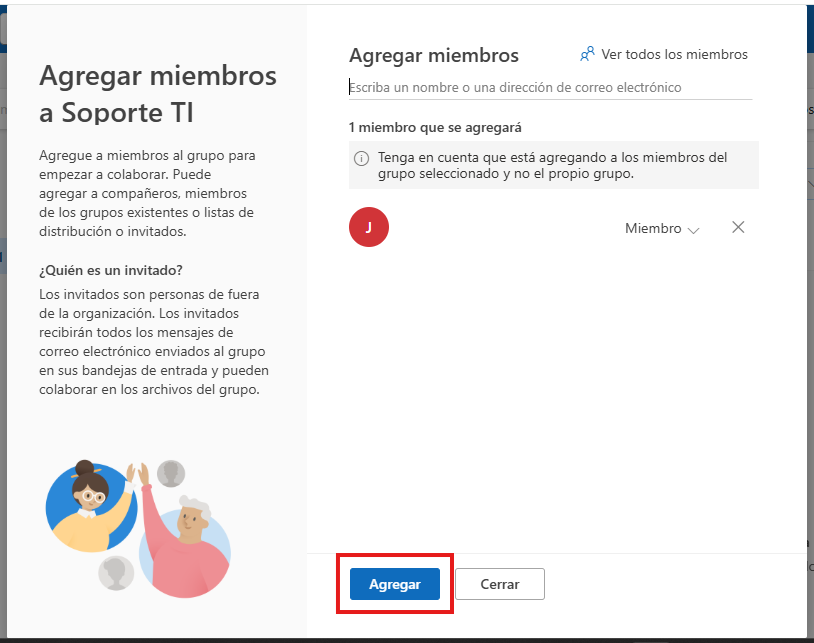

- **Paso 4.** Regresar a la pestaña de Planner.

- **Paso 5.** Revisar si existe algún usuario agregado que realmente no necesite participar y ajustar la membresía.

    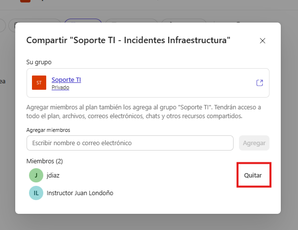

- **Nota:** Internamente los equipos pueden definir roles funcionales para organizar la participación de los miembros, por ejemplo:
    - **Coordinador TI:** supervisar avance y priorización.
    - **Analista N1:** ejecutar tareas operativas de soporte.
    - **Administrador de infraestructura:** ejecutar actividades técnicas especializadas.
    - **Validador:** revisar cierre y conformidad.
---
### Tarea 3. Definir normas mínimas de operación segura.
- **Paso 1.** Agregar nuevo "Bucket" o "Depósito" con el nombre "Normas de operación segura" para organizar las reglas de seguridad y orden del plan.

    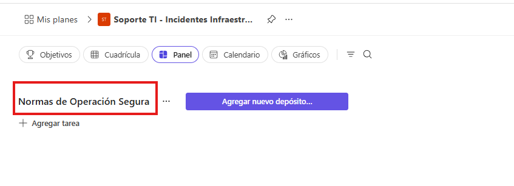

- **Paso 2.** Agregar tareas dentro del bucket para documentar las reglas de seguridad y orden del plan.
    - Ejemplo: "Reglas de seguridad del plan".
    - Ejemplo: "Reglas de orden operativo del plan".
    - Ejemplo: "Nota de gobierno del plan". 

    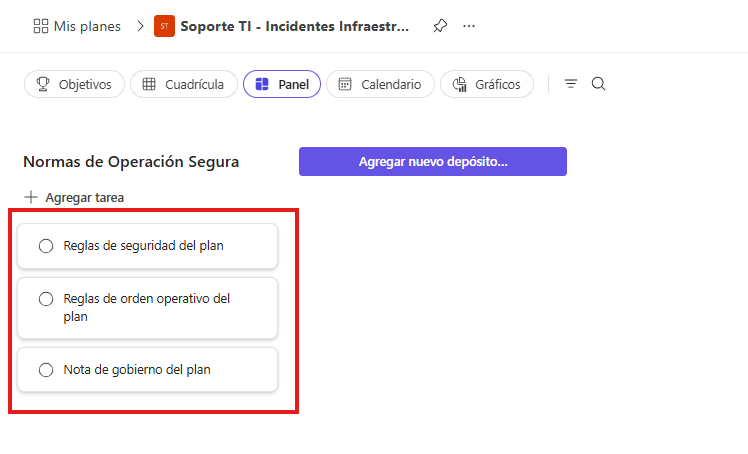

- **Paso 3.** En la Tarea: "Reglas de seguridad del plan". En la sección de "notas" escribir al menos dos reglas de seguridad para el plan.
   - Ejemplo: Solo los propietarios autorizan cambios estructurales del plan.
    - Ejemplo: La eliminación de tareas o buckets requiere validación del coordinador.

- **Paso 4.** En la Tarea "Reglas de orden operativo del plan". En la sección de "notas" escribir al menos dos reglas de orden operativo para el plan.
    - Ejemplo: Todas las tareas deben tener un responsable asignado.
    - Ejemplo: Todas las tareas deben tener fecha de vencimiento.
    - Ejemplo: No se pueden crear tareas sin una descripción clara del trabajo.

- **Paso 5.** En la Tarea "Nota de gobierno del plan". En la sección de "notas" escribir una nota breve que delimite el propósito del plan, los miembros activos, la regla de contenido y la regla de revisión. Ejemplo:
     - **Propósito:**
        Este plan se utiliza para registrar, asignar, dar seguimiento y cerrar incidentes de infraestructura TI que afecten la operación de servicios, redes, servidores, almacenamiento o conectividad de la organización.

    - **Miembros activos:**
        Participan en este plan el coordinador de soporte TI, los analistas de mesa de ayuda, el administrador de infraestructura, el especialista de redes y el responsable de validación o cierre del incidente.

    - **Regla de contenido:**
        Toda tarea creada en el plan debe incluir un título claro, una descripción breve del incidente, un responsable asignado y una fecha de vencimiento. No se deben registrar tareas incompletas o sin contexto operativo mínimo.

    - **Regla de revisión:**
        El plan debe revisarse al inicio de la jornada para validar incidentes abiertos, prioridades y responsables, y nuevamente al cierre para actualizar el estado de cada tarea y confirmar avances, bloqueos o cierres.

    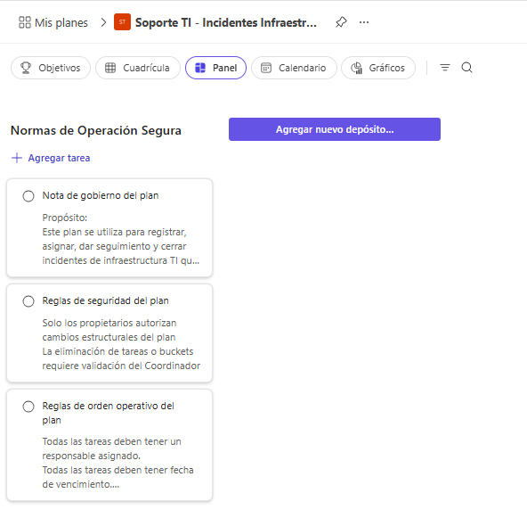

---
### Resultado esperado
El participante concluye con un plan correctamente creado, con miembros pertinentes, con participación delimitada y con reglas mínimas de seguridad y operación que favorecen orden, responsabilidad y control.

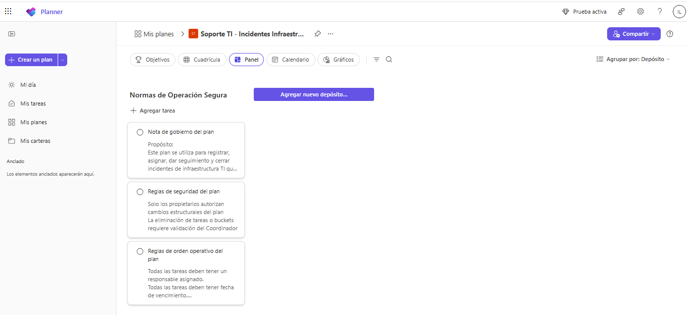
