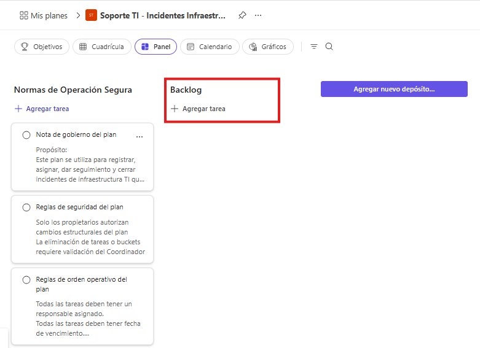
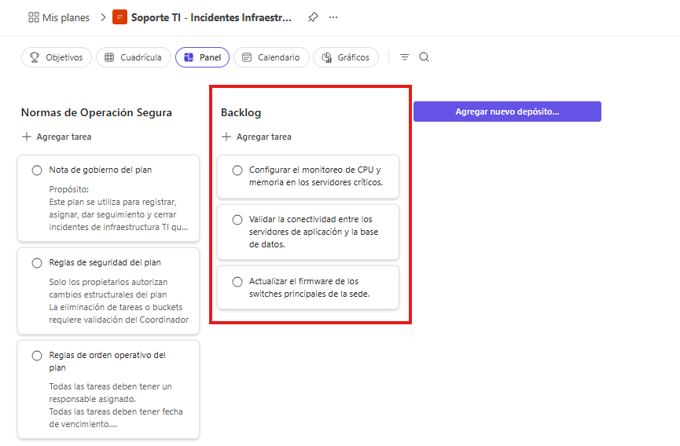
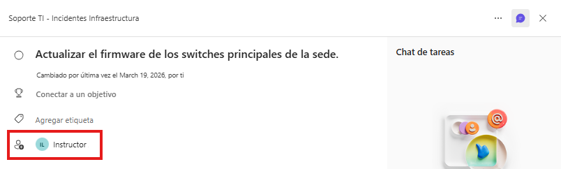
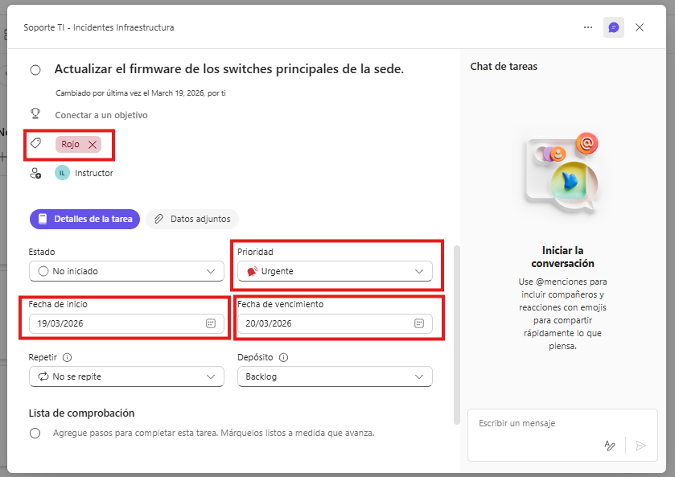
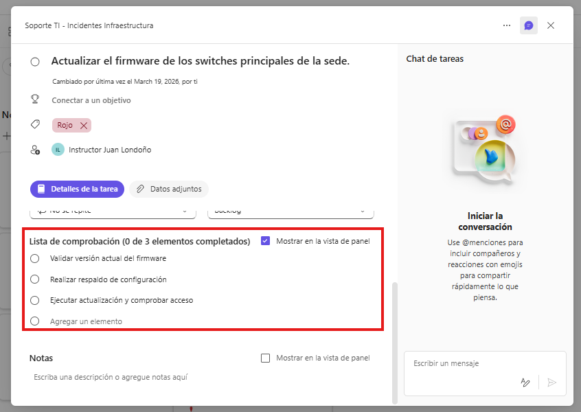
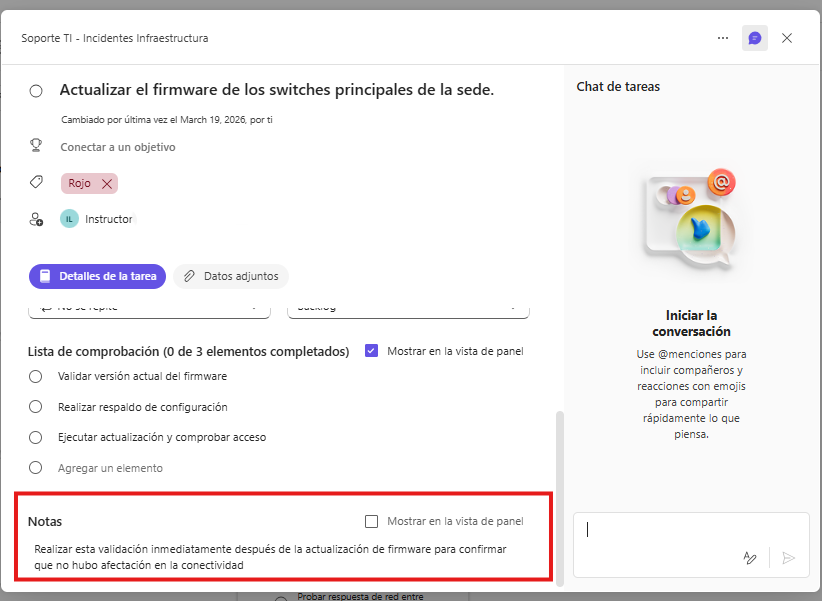
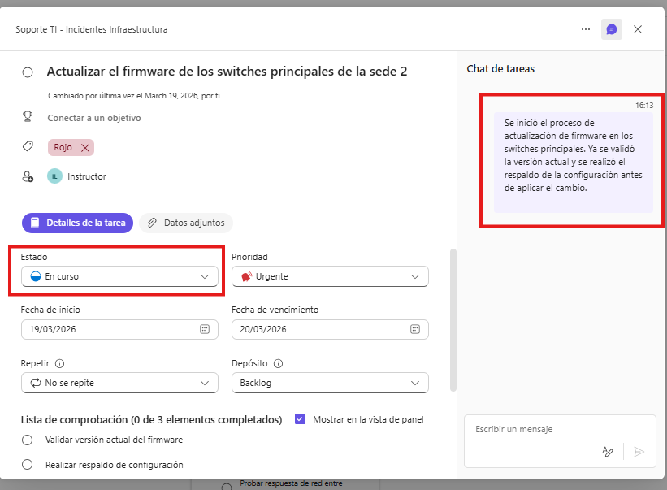
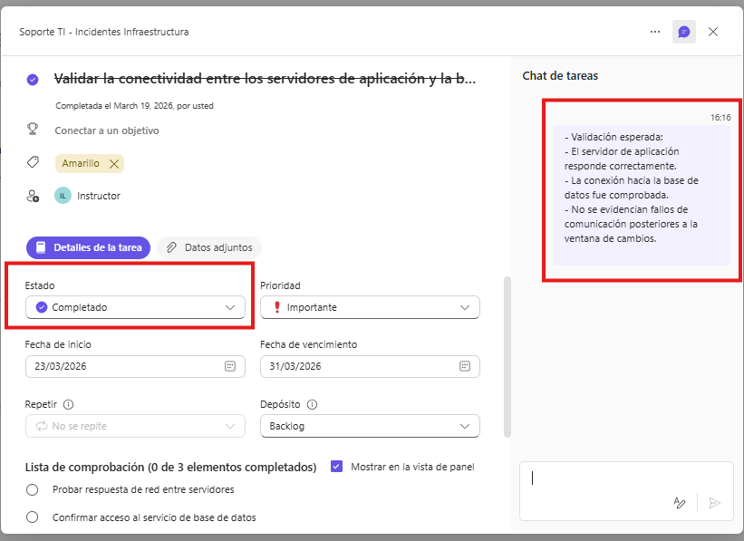
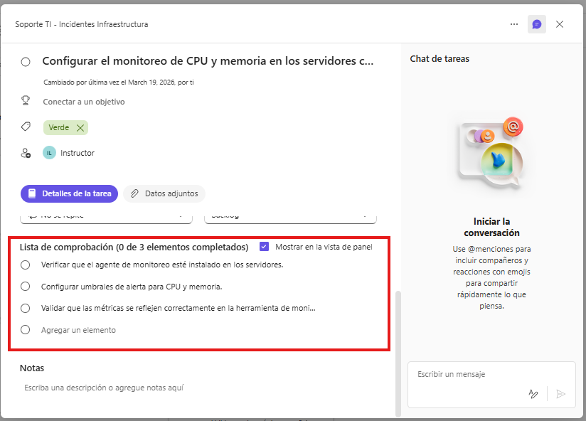
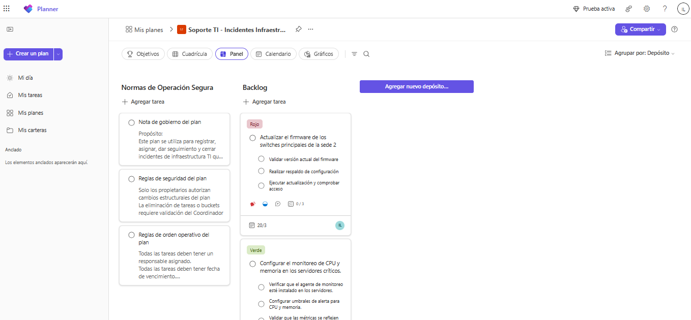

# Laboratorio 3: Crear tareas reales para un proyecto TI

## Objetivo de la práctica:
Al finalizar la práctica, serás capaz de:
- Transformar trabajo técnico en tareas claras y ejecutables.
- Configurar responsable, fechas, prioridad, etiquetas y checklist con criterio operativo.
- Actualizar el avance de manera visible para reflejar el estado real del trabajo.

## Duración aproximada:
- 15 minutos.

## Instrucciones

### Tarea 1. Construir un backlog inicial de actividades técnicas.
- **Paso 1.** Revisar el escenario del laboratorio: **Incidentes de infraestructura crítica que requieren atención inmediata durante una ventana de cambios programada.**

- **Paso 2.** Ingresar al plan **“Soporte TI - Incidentes Infraestructura”** y crear un bucket llamado **Backlog**, que servirá para concentrar las actividades pendientes de atención o preparación.

    

- **Paso 3.** Definir tres actividades operativas reales que el equipo de TI deba ejecutar durante la ventana de cambios.  
    - Ejemplo 1: `firmware switches sede principal`  
    - Ejemplo 2: `conectividad app y base de datos`  
    - Ejemplo 3: `monitoreo cpu y memoria servidores críticos`  

- **Paso 4.** Redactar correctamente cada actividad utilizando un verbo de acción y una descripción clara del trabajo a realizar, evitando nombres ambiguos, incompletos o demasiado generales.  
    - Ejemplo 1 bien redactado: `Actualizar el firmware de los switches principales de la sede.`  
    - Ejemplo 2 bien redactado: `Validar la conectividad entre los servidores de aplicación y la base de datos.`  
    - Ejemplo 3 bien redactado: `Configurar el monitoreo de CPU y memoria en los servidores críticos.`

- **Paso 5.** Crear una tarea en el bucket **Backlog** para cada una de las actividades definidas, utilizando la redacción clara y específica generada en el paso anterior.

    

- **Paso 6.** Verificar que el bucket **Backlog** contenga las tres tareas creadas y que sus nombres permitan identificar fácilmente el trabajo pendiente.
---
### Tarea 2. Configurar tareas completas dentro del plan.

- **Paso 1.** Tomar como base las **tres tareas** creadas en el bucket **Backlog** durante la Tarea 1 y abrir cada una para completar su configuración interna.

- **Paso 2.** Asignar como **responsable principal** de cada tarea a una de las personas que ya fueron agregadas previamente al grupo de **Microsoft 365** asociado al plan.

    

- **Paso 4.** Configurar en cada tarea la **fecha de inicio**, la **fecha límite**, la **prioridad** y la **etiqueta**, de acuerdo con el impacto y el momento en que debe ejecutarse cada actividad durante la ventana de cambios.

    - **Actualizar el firmware de los switches principales de la sede**
        - Inicio: `Insertar Fecha de Inicio`
        - Fecha límite: `Insertar Fecha Limite`
        - Prioridad: `Urgente`
        - Etiqueta: `Red`

    - **Validar la conectividad entre los servidores de aplicación y la base de datos**
        - Inicio: `Insertar Fecha de Inicio`
        - Fecha límite: `Insertar Fecha Limite`
        - Prioridad: `Importante`
        - Etiqueta: `Amarillo`

    - **Configurar el monitoreo de CPU y memoria en los servidores críticos**
        - Inicio: `Insertar Fecha de Inicio`
        - Fecha límite: `Insertar Fecha Limite`
        - Prioridad: `Media`
        - Etiqueta: `Verde`

    

    > ***Nota:** Imagen de ejemplo, hacer lo mismo para cada una de las tareas.*

- **Paso 5.** Agregar un **checklist** de al menos tres puntos en **dos tareas**, para dividir internamente el trabajo sin convertirlo en tareas independientes.

    - Ejemplo de checklist para **Actualizar el firmware de los switches principales de la sede**:
        - Validar versión actual del firmware
        - Realizar respaldo de configuración
        - Ejecutar actualización y comprobar acceso

    - Ejemplo de checklist para **Validar la conectividad entre los servidores de aplicación y la base de datos**:
        - Probar respuesta de red entre servidores
        - Confirmar acceso al servicio de base de datos
        - Registrar resultado de la validación

    

    > ***Nota:** Imagen de ejemplo, hacer lo mismo para cada una de las tareas seleccionadas.*

- **Paso 6.** Registrar en al menos una tarea un **comentario útil** o adjuntar un **recurso de apoyo** que facilite la ejecución de la actividad, como una observación operativa, un procedimiento breve o una evidencia de referencia.

    - Ejemplo de comentario:  
      `Realizar esta validación inmediatamente después de la actualización de firmware para confirmar que no hubo afectación en la conectividad.`

    

- **Paso 7.** Verificar que las **tres tareas** del bucket **Backlog** cuenten con la información mínima necesaria para su gestión: descripción, responsable, fechas, prioridad, etiqueta y, cuando aplique, checklist y comentario de apoyo.

---
### Tarea 3. Simular seguimiento y cierre operativo

- **Paso 1.** Cambiar la tarea **“Actualizar el firmware de los switches principales de la sede”** al estado **En curso** y registrar un comentario breve de avance.

    - Ejemplo de comentario:  
      `Se inició el proceso de actualización de firmware en los switches principales. Ya se validó la versión actual y se realizó el respaldo de la configuración antes de aplicar el cambio.`

    

- **Paso 2.** Cambiar la tarea **“Validar la conectividad entre los servidores de aplicación y la base de datos”** al estado **Completado** y dejar un comentario que refleje la validación realizada.

    - Validación esperada:
        - El servidor de aplicación responde correctamente.
        - La conexión hacia la base de datos fue comprobada.
        - No se evidencian fallos de comunicación posteriores a la ventana de cambios.

    

- **Paso 3.** Agregar un **checklist** a la tarea **“Configurar el monitoreo de CPU y memoria en los servidores críticos”**, con el fin de descomponer la actividad en pasos internos más manejables sin crear nuevas tareas.

    - Ejemplo de checklist:
        - Verificar que el agente de monitoreo esté instalado en los servidores.
        - Configurar umbrales de alerta para CPU y memoria.
        - Validar que las métricas se reflejen correctamente en la herramienta de monitoreo.

    

    
- **Paso 4.** Revisar el tablero  y justificar si la redacción de las tareas permite ejecutar el trabajo de forma autónoma, sin depender de explicaciones verbales adicionales.

    - Validar especialmente estas tres tareas:
        - **Actualizar el firmware de los switches principales de la sede**
        - **Validar la conectividad entre los servidores de aplicación y la base de datos**
        - **Configurar el monitoreo de CPU y memoria en los servidores críticos**

    - Criterios de validación:
        - Las tareas usan verbos de acción claros.
        - El nombre de cada tarea describe exactamente qué se debe hacer.
        - La descripción aporta contexto operativo suficiente.
        - El responsable, las fechas, la prioridad y la etiqueta facilitan el seguimiento.

---
### Resultado esperado
El participante deja creado un conjunto de tareas técnicas bien estructuradas, con responsables, fechas, prioridad, clasificación visual, checklist y seguimiento inicial, listas para coordinar trabajo real del equipo de TI.

