# 4.4 Laboratorio: Crear plantilla y organizar un plan por buckets

## Objetivo de la práctica:
Al finalizar la práctica, serás capaz de:
- Organizar un tablero usando buckets con un criterio único y comprensible.
- Convertir un plan operativo en una base reutilizable para ciclos futuros.
- Utilizar filtros, agrupaciones y vistas para validar la legibilidad del plan.

## Duración aproximada:
- 15 minutos.

## Instrucciones

### Tarea 1. Diseñar la lógica estructural del plan.
- **Paso 1.** Abrir el plan **“Soporte TI - Incidentes Infraestructura”** construido en los laboratorios anteriores y ubicar las tareas ya registradas en el bucket **Backlog**.

- **Paso 2.** Revisar las tres tareas existentes del plan, tomando como base el trabajo ya realizado:
    - **Actualizar el firmware de los switches principales de la sede**
    - **Validar la conectividad entre los servidores de aplicación y la base de datos**
    - **Configurar el monitoreo de CPU y memoria en los servidores críticos**

- **Paso 3.** Elegir un único criterio principal para reorganizar los buckets del plan. En este laboratorio se trabajará con una lógica similar a un flujo ágil, conservando el bucket **Backlog** como punto inicial de almacenamiento de tareas pendientes y creando buckets adicionales para representar el avance del trabajo.

- **Paso 4.** Crear los buckets necesarios para representar ese flujo de trabajo dentro del plan. Mantener el bucket **Backlog** ya creado en el laboratorio anterior y agregar los siguientes buckets:
    - **Por hacer**
    - **En curso**
    - **Completado**

- **Paso 5.** Verificar que los nombres de los buckets representen una secuencia clara y fácil de interpretar dentro del tablero. El objetivo es que cualquier miembro del equipo pueda identificar rápidamente qué tareas están pendientes, cuáles están en ejecución y cuáles ya fueron finalizadas, manteniendo una estructura visual simple y coherente.

    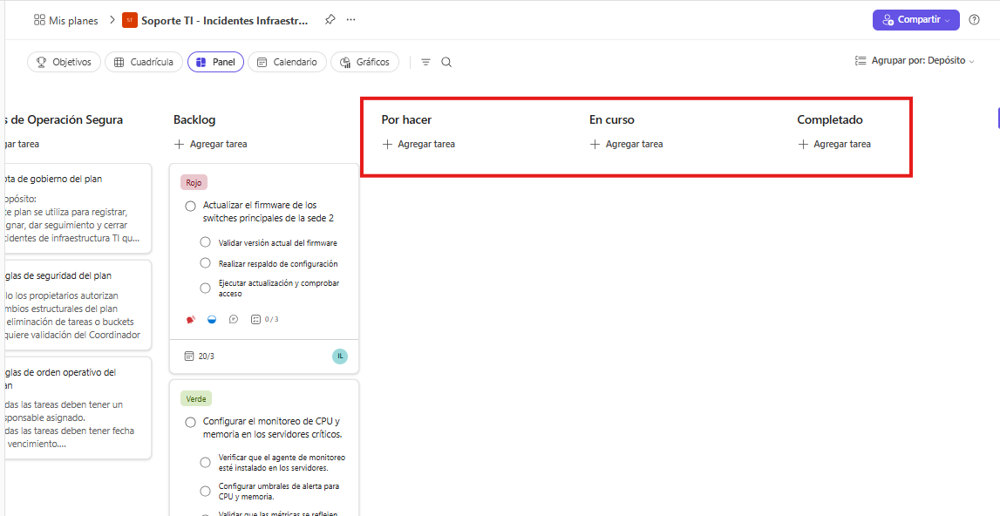

---
### Tarea 2. Convertir el tablero en una base reutilizable.
- **Paso 1.** Revisar que el plan **“Soporte TI - Incidentes Infraestructura”** ya tenga una estructura básica útil para reutilizar: buckets definidos, tareas representativas, prioridades, etiquetas y responsables configurados.

- **Paso 2.** Verificar que las tareas del plan conserven una redacción clara y consistente, de manera que puedan servir como referencia para futuros ciclos del mismo proceso. No es necesario cambiar los títulos si ya son comprensibles y ejecutables.

- **Paso 4.** Identificar qué elementos del tablero podrán reutilizarse en un próximo ciclo operativo. Considerar especialmente:
    - Datos adjuntos
    - Prioridad
    - Fechas
    - Descrioción
    - Lista de comprobación
    - Etiquetas
    
    > ***Nota:** El progreso y las asignaciones no se copian en los nuevos planes*

- **Paso 5.** Utilizar la opción de **copiar plan** en Microsoft Planner para generar una nueva versión del tablero a partir de la estructura actual, con el fin de simular un nuevo ciclo de trabajo sin tener que construir el plan desde cero.

    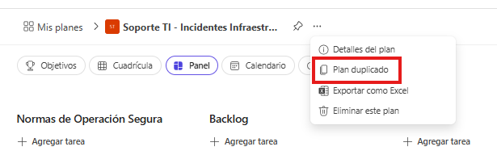

    - Asignar un nombre representativo a la copia.
        - Ejemplo: **Soporte TI - Incidentes Infraestructura - Ciclo 2**
                
    - Mantener en la copia los elementos que sirven como plantilla base del proceso.

    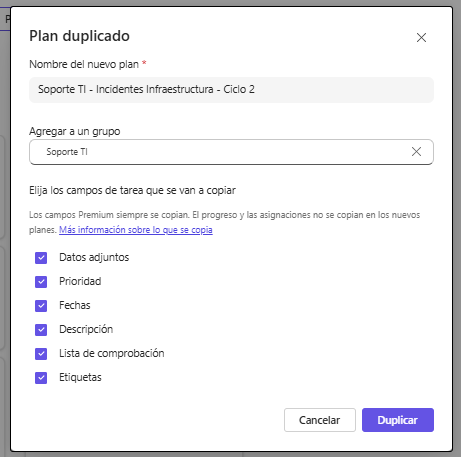

- **Paso 6.** Revisar el nuevo plan copiado y comprobar que conserva una estructura reutilizable para futuras ejecuciones del mismo tipo de trabajo.

    - Validar que en la copia se mantengan:
        - Los buckets del flujo de trabajo.
        - Las tareas base o de referencia.
        - Las etiquetas.
        - La lógica visual del tablero.

    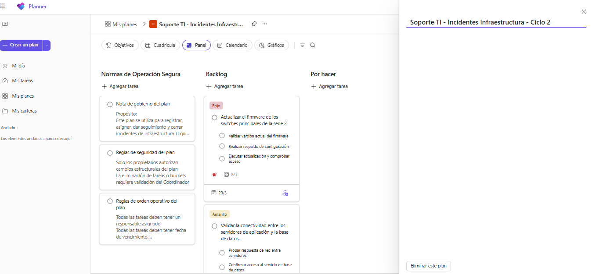
---
### Tarea 3. Validar si el plan realmente quedó fácil de leer.

- **Paso 1.** Abrir el plan **“Soporte TI - Incidentes Infraestructura”** y convertirlo de **Básico** a **Premium**, con el fin de habilitar vistas y capacidades avanzadas de planificación.
    -   Abra el plan básico en la nueva aplicación de Planner.
    -   Seleccione **Más (...).**
    -   En Agregar vistas premium, seleccione una de las opciones: **Personas**, **Tareas** o **Escala de tiempo**.
    -   Confirme que desea convertir el plan básico en un plan premium y seleccione **Sí, convertir ahora**.

    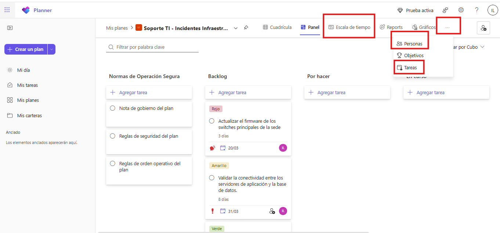

- **Paso 2.** Una vez convertido el plan a **Premium**, comprobar que el plan conserva las tareas, buckets y configuración base ya trabajada en los laboratorios anteriores, y confirmar que ahora dispone de vistas más amplias para analizar el trabajo desde distintas perspectivas.

- **Paso 3.** Aplicar filtros sobre el plan para comprobar si la información ya cargada permite localizar trabajo de manera rápida. Usar al menos los siguientes filtros:
    - **Prioridad**
    - **Responsable**
    - **Etiqueta**

    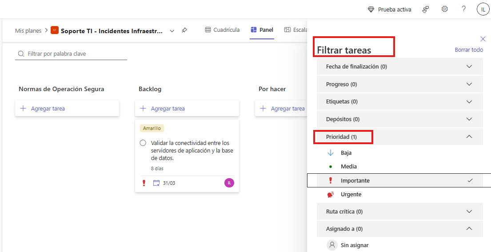

    > ***Nota:** Interactuar con los filtros del plan ayuda a validar si la información registrada en las tareas es útil para localizar trabajo específico, revisar cargas de trabajo o identificar tareas críticas.*

- **Paso 4.** Explorar las opciones de **agrupación** del plan para observar cómo cambia la lectura del trabajo según el criterio seleccionado. Probar al menos estas agrupaciones:
    - **Bucket o cubo**
    - **Asignado a**
    - **Progreso**
    - **Fecha de finalización**
    - **Etiquetas**
    - **Prioridad**
    - **Objetivo**

    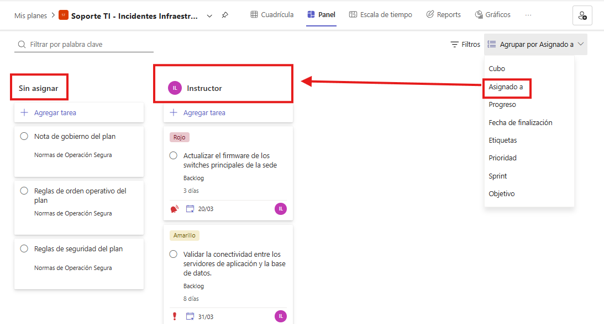

  >***Nota:** En Microsoft Planner, la agrupación permite reorganizar visualmente las mismas tareas sin moverlas manualmente, ofreciendo distintas formas de interpretar el plan desde el tablero.*

- **Paso 5.** Revisar si las fechas de inicio y vencimiento configuradas en las tareas forman una secuencia razonable para la ventana de cambios. Confirmar que el orden temporal del trabajo tenga lógica operativa y que no existan solapamientos confusos o tareas ubicadas fuera de secuencia. 

- **Paso 6.** Explorar de forma guiada todas las vistas disponibles del plan **Premium**, identificando qué aporta cada una para comprender mejor el trabajo del equipo. Recorrer las siguientes vistas:

    - **Cuadrícula:** revisar las tareas en formato tabular o de lista estructurada.
        
        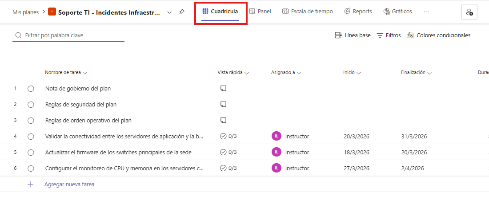

    - **Panel:** observar la distribución visual del trabajo por columnas o agrupaciones.
        
        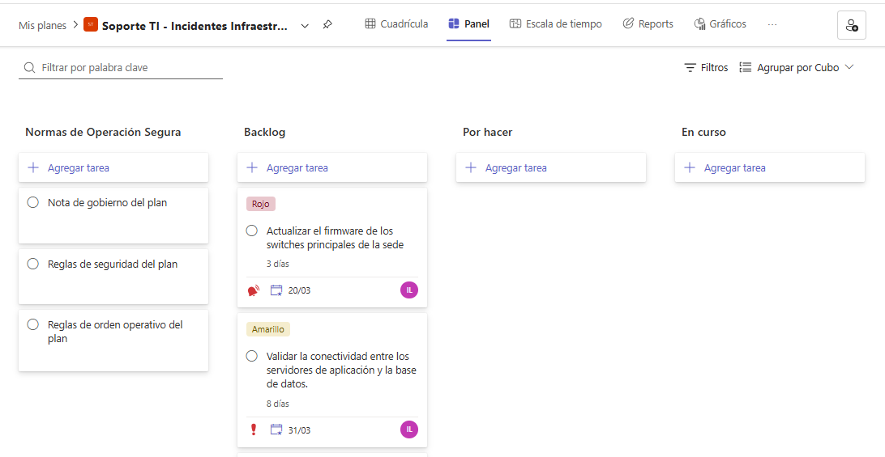

    - **Gráficos:** interpretar el avance del plan mediante indicadores visuales.
        
        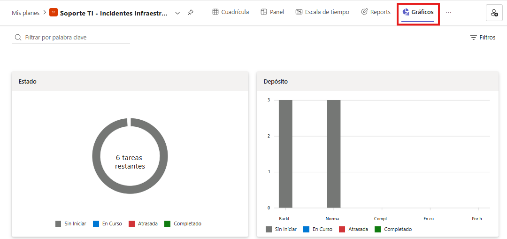

    - **Escala de tiempo:** revisar el trabajo en una secuencia cronológica tipo línea de tiempo.
        
        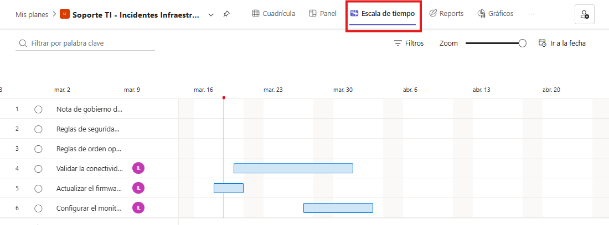

    - **Personas:** identificar la distribución de tareas por miembro del equipo.

        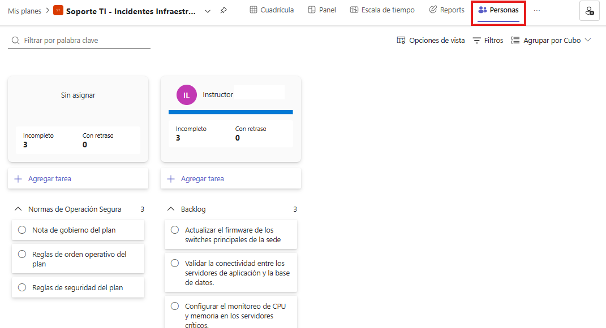

    - **Tareas:** revisar el conjunto general de tareas desde una perspectiva consolidada.
        
        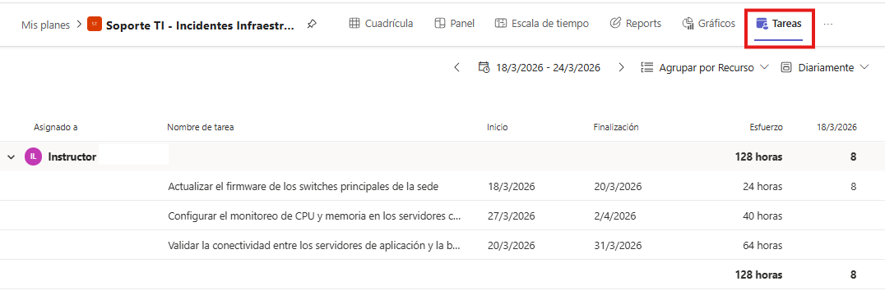

 
- **Paso 7.** Comparar las vistas recorridas y determinar cuáles resultan más útiles para este escenario de infraestructura TI. Como orientación:
    - **Panel** ayuda a ver el flujo de trabajo por etapas.
    - **Gráficos** ayuda a interpretar avance y distribución general.
    - **Escala de tiempo** ayuda a entender duración, secuencia y planificación.
    - **Personas** ayuda a revisar distribución de carga por responsable.

- **Paso 8.** Ajustar el tablero si se detecta alguno de estos problemas después de aplicar filtros, agrupaciones y vistas:
    - concentración excesiva de trabajo en una sola persona,
    - buckets poco claros,
    - fechas inconsistentes,
    - uso confuso de etiquetas o prioridades,
    - tareas difíciles de interpretar en más de una vista.

- **Paso 9.** Revisar el resultado final y justificar si el plan quedó realmente fácil de leer desde múltiples perspectivas, tanto para seguimiento operativo diario como para reutilización en futuros ciclos del equipo.

---
### Resultado esperado
El participante transforma un plan básico en un tablero estructurado, legible y reutilizable, con buckets coherentes, criterio de organización definido y una base lista para repetirse en futuros ciclos operativos.

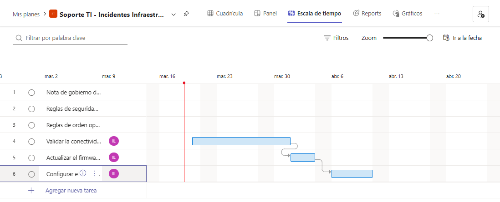
