# 5.4 Laboratorio: Vincular un plan con Teams y verificar notificaciones

## Objetivo de la práctica:
Al finalizar la práctica, serás capaz de:
- Llevar un plan de Planner al espacio cotidiano de colaboración del equipo.
- Verificar el efecto operativo de asignaciones, cambios y vencimientos.
- Distinguir cómo se complementan Planner y Teams

## Duración aproximada:
- 15 minutos.

## Instrucciones

### Tarea 1. Llevar el plan al contexto de Teams. 
- **Paso 1.** Ingresar a **Microsoft Teams** con la cuenta de laboratorio y acceder al equipo o canal definido para la práctica.
    > https://teams.cloud.microsoft/

- **Paso 2.** En la opción "ver mas aplicaciones" buscar Planner para agregarlo como una pestaña dentro de Teams.

    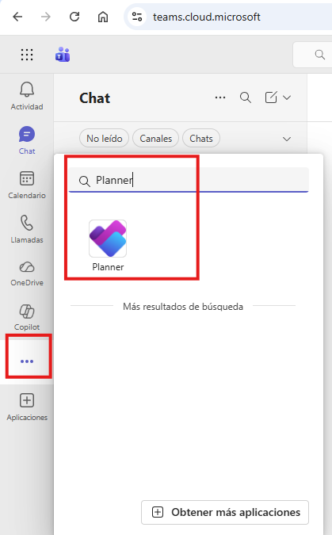

- **Paso 3.** Acceder a la experiencia de tareas integrada en Teams para visualizar Planner sin salir del contexto de colaboración del equipo.

    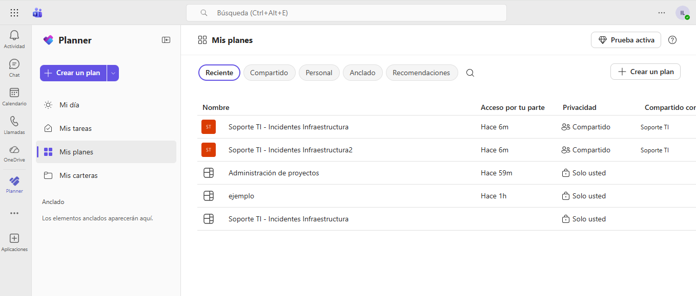

- **Paso 4.** Asociar, abrir o localizar dentro de Teams el plan trabajado en los laboratorios anteriores. Como referencia, utilizar el plan **“Soporte TI - Incidentes Infraestructura”** o la copia generada en el laboratorio anterior, si se trabajó la reutilización del plan.

    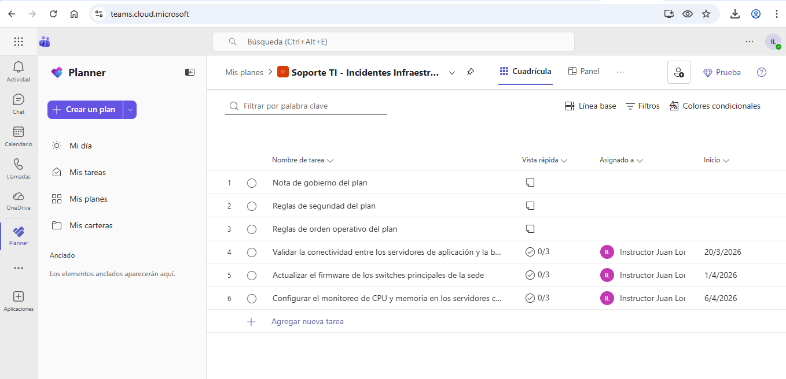

- **Paso 5.** Ahora ingresando a un equipo o canal de Teams, el plan de Planner se vuelve parte del espacio colaborativo del equipo, lo que facilita su consulta y actualización sin necesidad de cambiar de aplicación.

- **Paso 6.** Crear un equipo de Teams desde el grupo de Microsoft 365 asociado al plan.
    - Dar clic en "Equipos" en el menú lateral izquierdo de Teams.
    - En la parte superior dar clic en los tres puntos "..." y seleccionar "Sus equios y canales"
        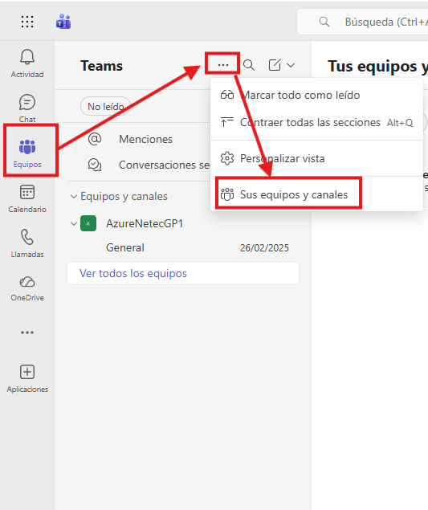

    - En la parte superior derecha, dar clic en "Crear equipo" y luego seleccionar "Mas opciones de creación de equipos"
        
        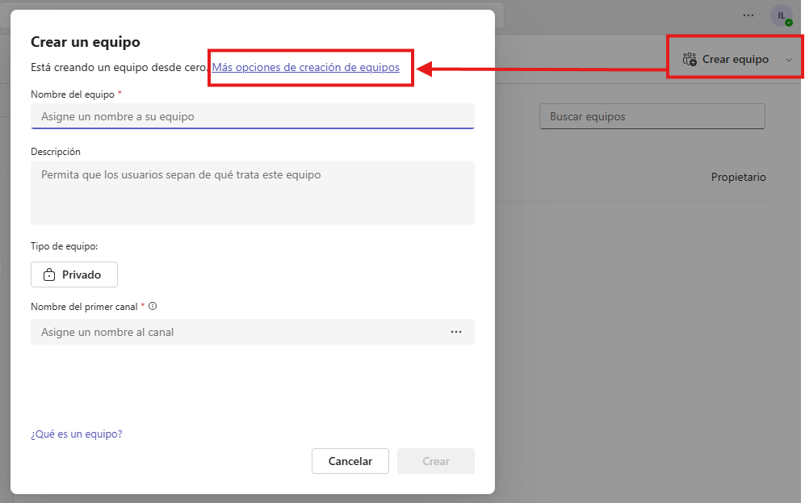

    - Seleccionar "Desde grupo" y seleccionar el grupo de Microsoft 365 creado anteriormente.
        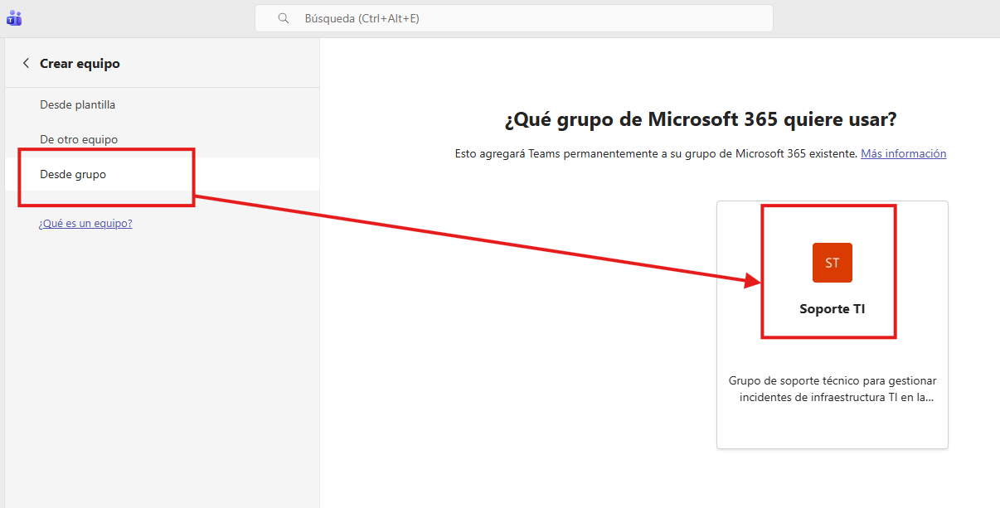

- **Paso 7.** Dar clic en el apartado de "Equipos" y luego en un equipo en el que estés incluido.

    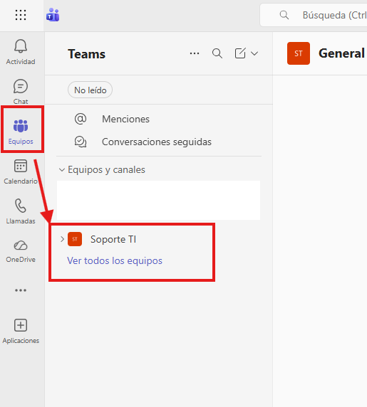
    
- **Paso 8.** En la parte superior, seleccionar el símbolo de "+" para agregar una nueva pestaña y luego en "Aplicaciones" buscar Planner para agregarlo como una pestaña dentro de Teams.

    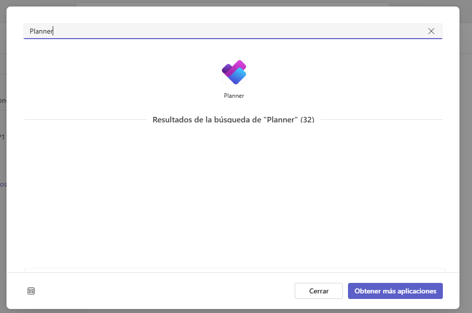

- **Paso 9.** Seleccionar el plan de Planner que se ha trabajado en los laboratorios anteriores para integrarlo como una pestaña dentro del equipo o canal de Teams. Para ello, dar clic en "Agregar un plan existente".

    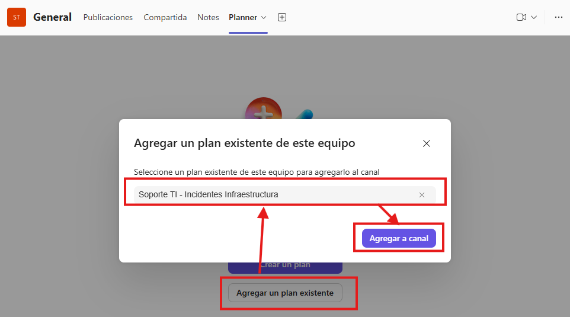

- **Paso 10.** Confirmar que el plan se ha agregado correctamente como una pestaña dentro de Teams, lo que permitirá a los miembros del equipo acceder al plan sin salir del entorno de colaboración.

    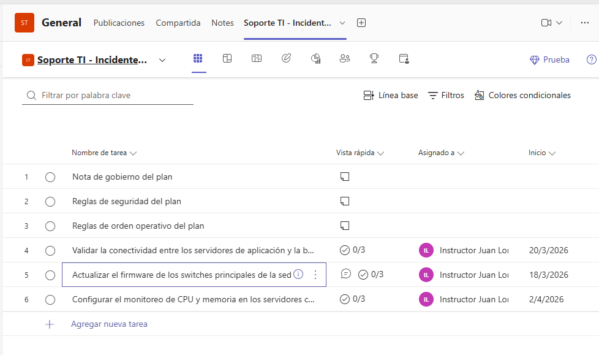
---

### Tarea 2. Provocar eventos de seguimiento y revisar notificaciones.

- **Paso 1.** Seleccionar la tarea **Actualizar el firmware de los switches principales de la sede** y cambiar la fecha de inicio y finalización para el día actual (hoy).

    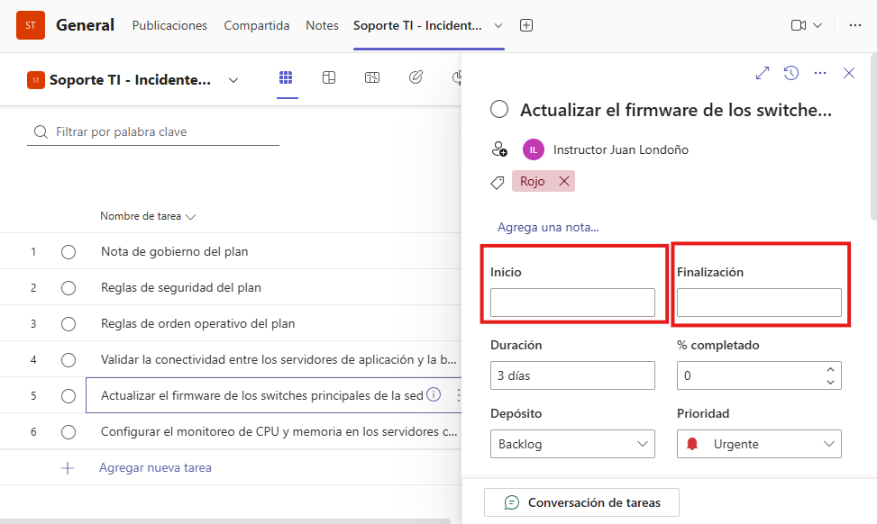

- **Paso 2.** Esto genera una alerta de vencimiento próximo o vencido, dependiendo del momento en que se realice el cambio. Verificar si se genera alguna notificación o aviso relacionado con este cambio, especialmente en Outlook
    - Abrir el correo electrónico asociado a la cuenta
        > https://outlook.office.com/mail/
    
    - Revisar la bandeja de entrada, el correo de notificación sobre las tareas prontas a vencer.
        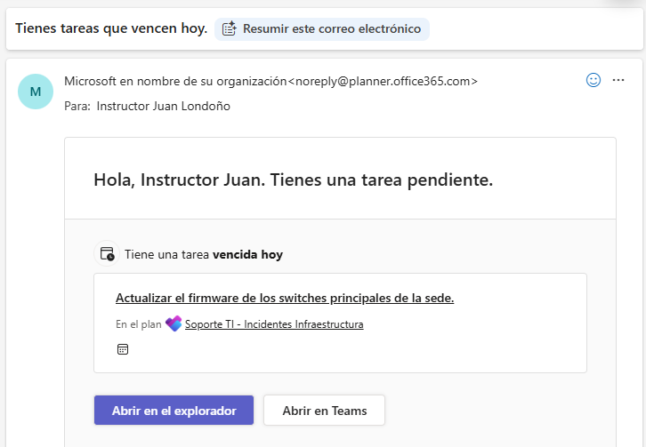

        > ***Nota:** Las notificaciones pueden tardar en llegar posterior al cambio en Planner y variar dependiendo de la configuración de cada usuario, pero generalmente se reciben alertas por correo electrónico.*

---
### Resultado esperado
El participante confirma que el valor de Planner aumenta cuando el plan se acerca a Teams, cuando Outlook apoya la disciplina de seguimiento.

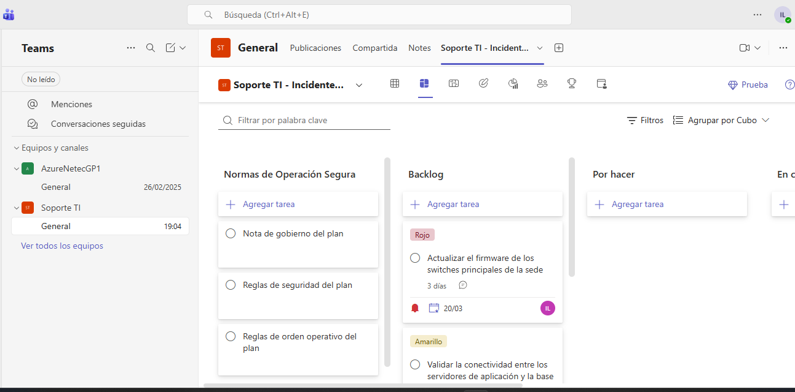

---
