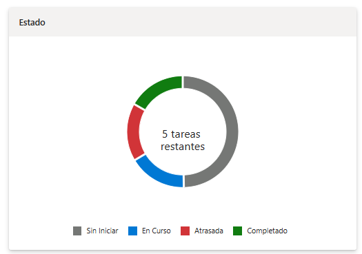
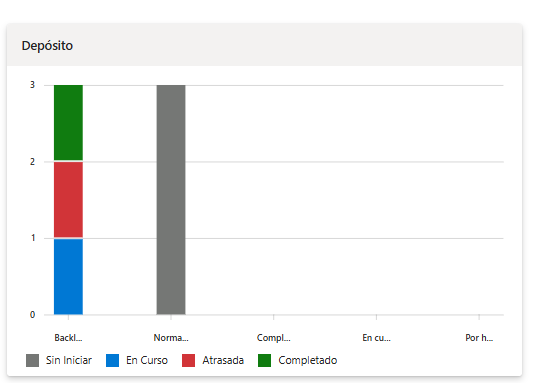
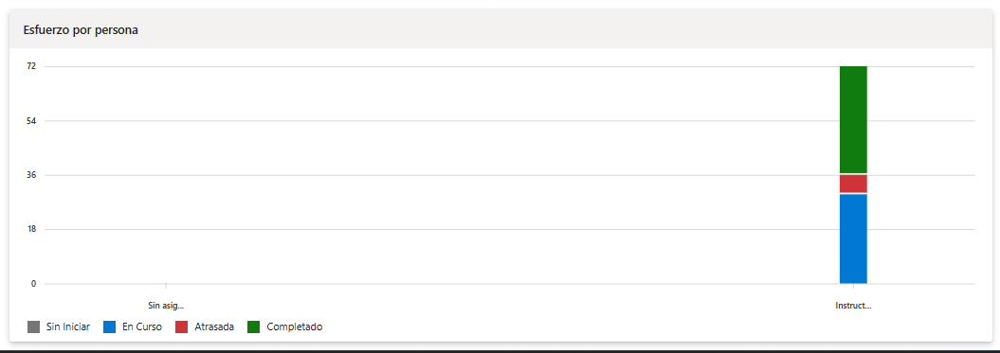
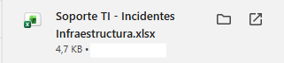
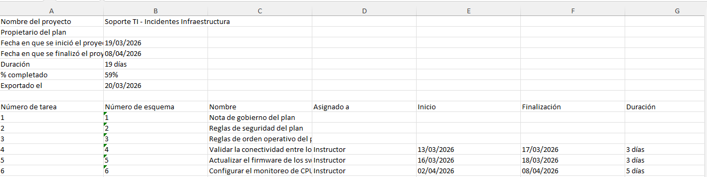
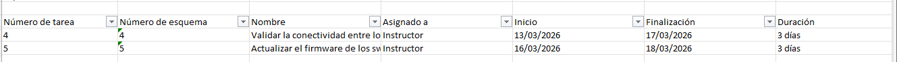
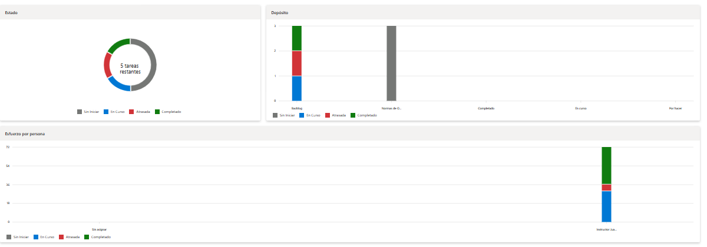

# 6.4 Laboratorio: Generar reporte y revisar métricas de un plan

## Objetivo de la práctica:
Al finalizar la práctica, serás capaz de:
- Leer el estado de un plan desde sus vistas de progreso y distribución.
- Exportar información del plan para análisis rápido en Excel.
- Redactar un reporte breve y útil para seguimiento operativo.

## Duración aproximada:
- 15 minutos.

## Instrucciones

### Tarea 1. Extraer una lectura rápida del tablero.
- **Paso 1.** Abrir el plan trabajado en los laboratorios anteriores, por ejemplo **“Soporte TI - Incidentes Infraestructura”**, y acceder a la vista de **Gráficos**

- **Paso 2.** Identificar la distribución de tareas por estado y registrar cuántas actividades se encuentran en cada una de las siguientes categorías:
    - **Sin Iniciar**
    - **En curso**
    - **Atrasadas**
    - **Completado**

  Para realizar esta revisión, tomar como referencia las tareas trabajadas en laboratorios anteriores, por ejemplo:
    - **Actualizar el firmware de los switches principales de la sede**
    - **Validar la conectividad entre los servidores de aplicación y la base de datos**
    - **Configurar el monitoreo de CPU y memoria en los servidores críticos**

    

- **Paso 3.** Revisar la distribución por **bucket** para detectar en qué parte del proceso se concentra mayor cantidad de trabajo. Si en el laboratorio 4 el plan fue reorganizado por buckets, observar en cuál de ellos hay más tareas pendientes, en curso o completadas.

    

- **Paso 4.** Revisar la distribución por **responsable** para identificar si la carga de trabajo está equilibrada o si existe concentración de tareas en una sola persona. Observar si uno o más integrantes del equipo tienen asignadas más actividades que los demás.

    
- **Paso 5.** Registrar **tres observaciones objetivas** sobre el estado actual del plan, sin interpretar todavía causas ni proponer soluciones. Las observaciones deben describir solo lo que se ve en el tablero.

  - Analizar:
    - ¿Hay tareas atrasadas? ¿Cuántas?
    - ¿Cuántas tareas están en curso?
    - ¿Qué bucket tiene más tareas pendientes?
    - ¿Qué responsable tiene más tareas asignadas?

---

### Tarea 2. Exportar el plan y realizar una lectura complementaria.
- **Paso 1.** en la parte superior, al lado del nombre del plan, hacer clic en los tres puntos para desplegar el menú de opciones y seleccionar **Exportar a Excel**. Esto generará un archivo con la información de las tareas del plan.

   

- **Paso 2.** Abrir el archivo exportado en **Excel web** o **Excel de escritorio** y reconocer las columnas que ayuden a analizar el estado del trabajo. Identificar especialmente columnas relacionadas con:
    - nombre de la tarea,
    - responsable,
    - progreso o estado,
    - prioridad,
    - bucket,
    - fecha de inicio,
    - fecha límite,
    - etiquetas.

    

- **Paso 3.** Aplicar al menos un filtro para localizar información de interés operativo. Elegir una de estas opciones:
    - tareas **urgentes**,
    - tareas **atrasadas**,
    - tareas **abiertas por responsable**,
    - tareas agrupadas o filtradas por **bucket**.

    

    >***Nota:** Se filtra por prioridad y se obtiene el resultado de la imagen.*

  El propósito es comprobar qué tipo de lectura se vuelve más clara cuando la información se analiza en formato tabular.

- **Paso 4.** Registrar **dos hallazgos** que resulten más fáciles de identificar en Excel que en el tablero visual de Planner.

  - Ejemplos:
    - `En Excel es más fácil ver qué responsable concentra más tareas abiertas.`
    - `El cruce entre prioridad y fecha límite permite ubicar rápidamente tareas críticas pendientes.`
---

### Tarea 3. Generar un reporte breve de seguimiento.
- **Paso 1.** Redactar un **reporte operativo de 5 a 8 líneas** utilizando la siguiente estructura:
    - estado general del plan,
    - principal avance observado,
    - principal riesgo detectado,
    - responsable o bucket que requiere atención,
    - acción recomendada antes de la siguiente revisión.

  El reporte debe resumir la situación del plan de manera breve, clara y útil para una reunión de seguimiento.

  - Ejemplo de estructura:
    - `El plan presenta un avance parcial con tareas en ejecución y una tarea completada.`
    - `El principal avance es la validación exitosa de la conectividad entre servidores.`
    - `El principal riesgo es la concentración de actividades técnicas en un solo responsable.`
    - `El bucket de Ejecución requiere mayor seguimiento por acumulación de trabajo.`
    - `Se recomienda redistribuir tareas y revisar prioridades antes de la siguiente ventana de cambios.`

- **Paso 2.** Definir **cuatro indicadores simples** que el equipo podría revisar cada semana para dar seguimiento al plan. Utilizar indicadores prácticos, comprensibles y fáciles de actualizar.

  - Ejemplos de indicadores:
    - porcentaje de tareas completadas,
    - número de tareas atrasadas,
    - tareas abiertas por responsable,
    - tareas urgentes pendientes.

- **Paso 3.** Presentar oralmente el reporte al grupo como si se tratara de una **reunión breve de seguimiento TI**.

---
### Resultado esperado
El participante traduce un tablero de Planner en una lectura útil para gestión operativa, combina vistas visuales con análisis rápido en Excel y produce un reporte breve que sirve para orientar decisiones del equipo.

   
