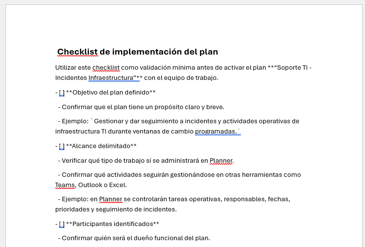
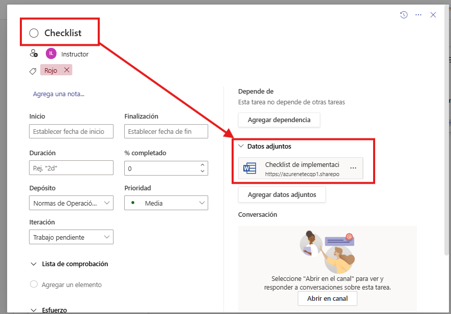
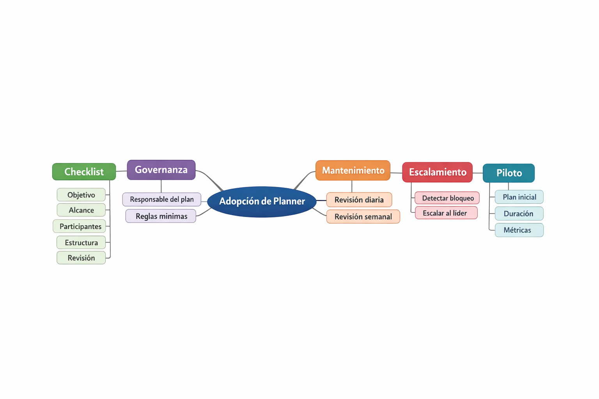

# Laboratorio 7: Elaborar checklist y plan de puesta en marcha

## Objetivo de la práctica:
Al finalizar la práctica, serás capaz de:
- Diseñar un checklist mínimo para implementar Planner en un equipo TI.
- Definir reglas de gobernanza, mantenimiento y escalamiento del plan.

## Duración aproximada:
- 15 minutos.

## Instrucciones

### Tarea 1. Construir el checklist de implementación.
- **Paso 1.** Definir el escenario operativo en el que se pondrá en marcha Planner, tomando como base el trabajo desarrollado en los laboratorios anteriores.

    > ***Nota:** Para este laboratorio, utilizar como referencia el escenario de **Soporte TI - Incidentes Infraestructura**, orientado al seguimiento de actividades durante ventanas de cambios, validaciones técnicas y control de tareas operativas.*

- **Paso 2.** Redactar el propósito exacto del plan en una frase breve, clara y específica. La redacción debe indicar para qué se usará el plan y qué tipo de trabajo se controlará en él.

  - Ejemplo:
    `Gestionar y dar seguimiento a incidentes y actividades operativas de infraestructura TI durante ventanas de cambio programadas.`

- **Paso 3.** Delimitar qué trabajo sí se gestionará en Planner y qué trabajo seguirá administrándose en otras herramientas. La intención es evitar que el plan se convierta en un espacio genérico para cualquier actividad del equipo.

  - **En Planner:**
    - tareas operativas del equipo,
    - actividades de validación,
    - seguimiento de responsables,
    - control de fechas, prioridades y avances,
    - trabajo coordinado durante la ventana de cambios.

  - **En otras herramientas:**
    - conversación y coordinación diaria en **Teams**,
    - notificaciones y recordatorios en **Outlook**,
    - análisis tabular y lectura complementaria en **Excel**,
    - atención móvil breve cuando se requiera continuidad operativa.

- **Paso 4.** Elaborar un checklist de implementación en un documento Word con al menos los siguientes puntos, utilizando el escenario del laboratorio como referencia. El checklist debe servir como guía mínima antes de activar el plan con el equipo.

  - objetivo del plan,
  - alcance,
  - participantes,
  - acceso y entorno,
  - estructura inicial,
  - etiquetas o prioridades,
  - frecuencia de revisión,
  - criterio de cierre o archivo.

    

    > ***Nota:** El checklist debe ser breve, claro y aplicable al contexto del equipo. Se recomienda utilizar un formato de lista con viñetas o numeración para facilitar su lectura y aplicación.*
  

- **Paso 5.** Revisar si el checklist quedó claro, breve y aplicable al contexto del equipo. Confirmar que cualquier integrante pueda entenderlo y utilizarlo como guía básica de implementación sin requerir explicación adicional.

- **Paso 6.** Crear una tarea "Checklist" en el bucket "Normas de Operación Segura" del plan de laboratorio, adjuntar el checklist elaborado y asignar la tarea a los propietarios del plan.

    
---

### Tarea 2. Definir gobernanza, mantenimiento y manejo de conflictos.

- **Paso 1.** Nombrar un **dueño funcional del plan**, es decir, la persona responsable de velar por la organización del tablero, la consistencia de uso y el seguimiento general del proceso.

  - Ejemplo:
    - **Dueño funcional del plan:** Coordinador de Soporte TI

- **Paso 2.** Definir quiénes participarán en el plan según su función operativa. Utilizar una distribución simple basada en el escenario trabajado en los laboratorios anteriores.

  - **Ejecutores:** analistas o técnicos que realizan las tareas.
  - **Líderes por frente:** responsables de red, infraestructura o validación.
  - **Usuarios de seguimiento:** personas que necesitan visibilidad del plan, pero no necesariamente ejecutan tareas.

  - Ejemplo:
    - **Ejecutor:** Analista N1
    - **Líder por frente:** Administrador de infraestructura
    - **Usuario de seguimiento:** Coordinador TI o validador

- **Paso 3.** Establecer al menos **dos reglas de gobernanza** y **dos reglas de mantenimiento** que orienten el uso del plan. Las reglas deben ser breves, accionables y alineadas con la operación real del equipo.

  - **Reglas de gobernanza:**
    - Toda tarea debe tener un responsable principal.
    - Toda tarea debe incluir una descripción breve y una fecha de vencimiento.

  - **Reglas de mantenimiento:**
    - Toda tarea bloqueada debe incluir un comentario de seguimiento.
    - El tablero debe revisarse y depurarse de forma periódica para evitar tareas obsoletas.

- **Paso 4.** Resolver un caso breve de conflicto operativo utilizando el plan como herramienta de seguimiento. Elegir una de las siguientes situaciones y proponer cómo se resolvería dentro del flujo del equipo:

  - tarea bloqueada por otra área,
  - prioridad mal asignada,
  - responsable ambiguo.

  - **Ejemplo de resolución:**
    - Caso: una tarea quedó bloqueada porque depende del equipo de redes.
    - Acción: registrar el bloqueo en el comentario de la tarea, mantener visible el responsable actual, actualizar prioridad si corresponde y notificar al líder por frente para seguimiento.

- **Paso 5.** Documentar la **regla de escalamiento** que seguirá el equipo cuando una tarea no pueda resolverse en el flujo normal. La regla debe indicar cuándo se escala, a quién y con qué criterio.

  - Ejemplo:
    `Toda tarea bloqueada por más de 24 horas, o que dependa de un tercero sin respuesta, debe ser escalada al coordinador de soporte TI para validación de prioridad, reasignación o gestión con otra área.`

---

### Tarea 3. Preparar el plan de arranque del piloto.
- **Paso 1.** Diseñar un piloto pequeño y concreto, utilizando un alcance controlado en lugar de intentar migrar toda la operación del equipo desde el primer día. Basarse en un caso similar al ya trabajado en el curso.

  - Ejemplo:
    - piloto de seguimiento de incidentes de infraestructura durante una sola ventana de cambios,
    - o piloto de control de tres a cinco tareas críticas del equipo.

- **Paso 2.** Definir la duración inicial del piloto, el criterio de éxito y la primera reunión de revisión. El piloto debe ser suficientemente corto para evaluarse rápido, pero con el tiempo necesario para observar uso real del plan.

  - Ejemplo:
    - **Duración inicial:** 1 semana
    - **Criterio de éxito:** todas las tareas del piloto fueron registradas, asignadas y actualizadas en Planner
    - **Primera reunión de revisión:** al cierre de la semana operativa

- **Paso 3.** Completar la mini ficha de salida del piloto, utilizando un formato breve y directo como el siguiente:

  - **Qué plan se activará primero:**  
    `Soporte TI - Incidentes Infraestructura`

  - **Quién lo liderará:**  
    `Coordinador de Soporte TI`

  - **Qué métrica simple se revisará:**  
    `Porcentaje de tareas completadas y número de tareas atrasadas`

  - **Qué decisión se tomará al finalizar el piloto:**  
    `Mantener el plan como práctica estable, ajustarlo antes de ampliarlo o descartar elementos que no aporten valor`

- **Paso 4.** Presentar al instructor la propuesta del piloto y justificar por qué es **realista, simple y sostenible**. La justificación debe mostrar que:
    - el alcance es controlado,
    - el equipo puede adoptarlo sin sobrecarga,
    - y el piloto permite obtener aprendizaje antes de extender Planner a más procesos.

---
### Resultado esperado
El participante termina con un esquema básico y aplicable de adopción de Planner: checklist de implementación, reglas mínimas de gobernanza, rutina de mantenimiento, criterio de escalamiento y un piloto concreto para comenzar con bajo riesgo y alta visibilidad.

---